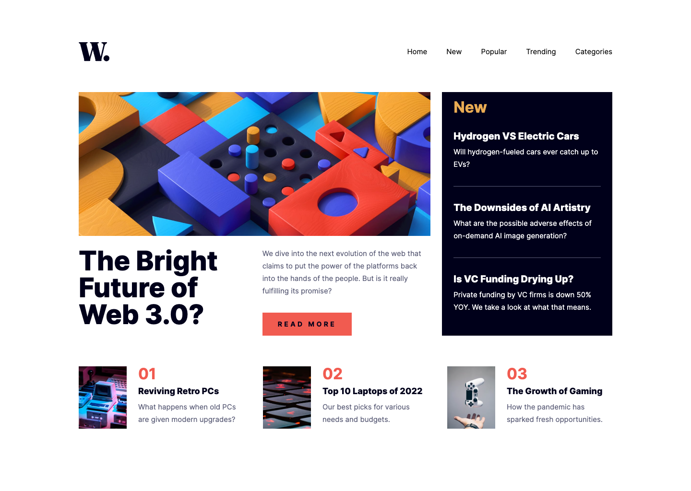

# News homepage solution

## Table of contents

- [Overview](#overview)
    - [Screenshot](#screenshot)
    - [Installation](#installation)
- [My process](#my-process)
    - [Built with](#built-with)
- [Author](#author)

## Overview

### Screenshot



### Installation

1. Clone the repository:
   ```bash
   git clone https://github.com/anamaydev/news-homepage.git
   cd news-homepage 
   ```
2. Install dependencies:
   ```bash
   npm install
   ```
3. Start the development server:
   ```bash
   npm run dev
   ```

## My process

### Built with

- Semantic HTML5 markup
- CSS custom properties
- Flexbox
- CSS Grid
- Mobile-first workflow
- React JS library

## Author

- @anamaydev - [https://github.com/anamaydev](https://github.com/anamaydev)